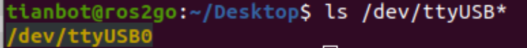

# 激光雷达密封环境的地图的构建与对比

## 1. 激光雷达构建环境地图
- 1. 激光雷达接收器连接电脑上
  


- 2. 检查是否正常被连接：
```
ls /dev/ttyUSB*
```


- 3. 启动ROS雷达驱动：
```
roslaunch tianbot_mini lidar.launch
```


- 4. 若采样率 >=4k ,方为正常，若不大于等于4k：ctrl c 关闭驱动 ，重启即可
  
  第一次为3k
  


  第二次为5k（可以使用）
  


- 5. 新建终端，输入: rviz 打开可视化工具查看

   
 
- 6. 打开左下角 add ，在by topic 添加一个话题；选中：/tianbot_mini   /scan  LaserScan
 
 
- 7. 出现报错，在Global Options里的Fixed Frame里添加 tianbot_mini/laser 即可

  
- 8. 在LaserScan 列表的Size参数里，设置0.05使可视化更清晰
 
    

- 9. 查看现实与扫描地图对比

  1）门后
  
    
  
  2）四周包围

  
    
